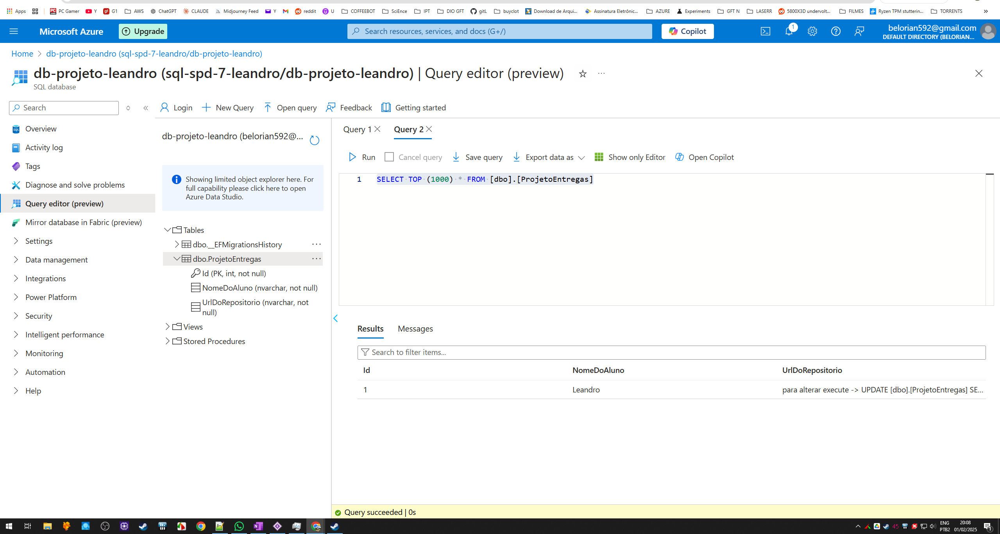

# Ambiente Azure + deploy via Terraform (IaaS).

Repositório referente a construção de ambiente em cloud Azure envolvendo Kubernetes clusters e conversão e deploy deste ambiente por meio de Terraform, permitindo a aplicação prática de IaaS.

Abaixo evidência do projeto construído via portal, a partir do tutorial da aula 7 rodando na Azure.

